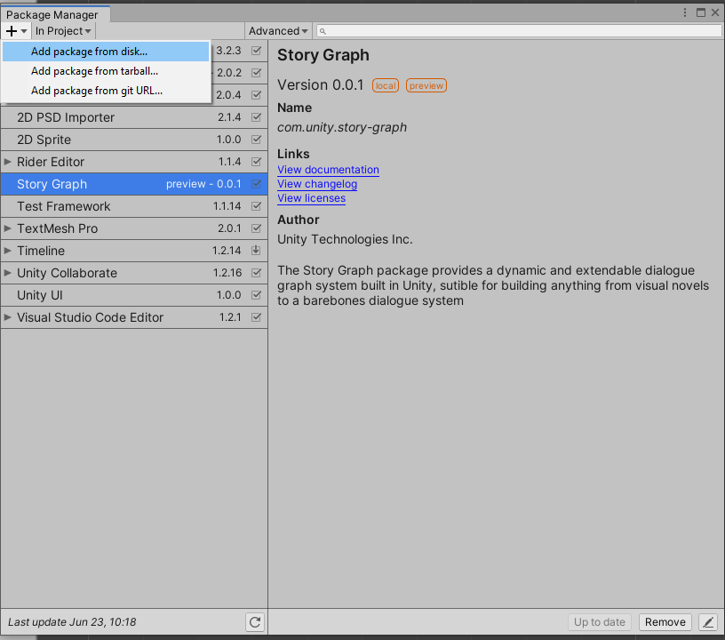
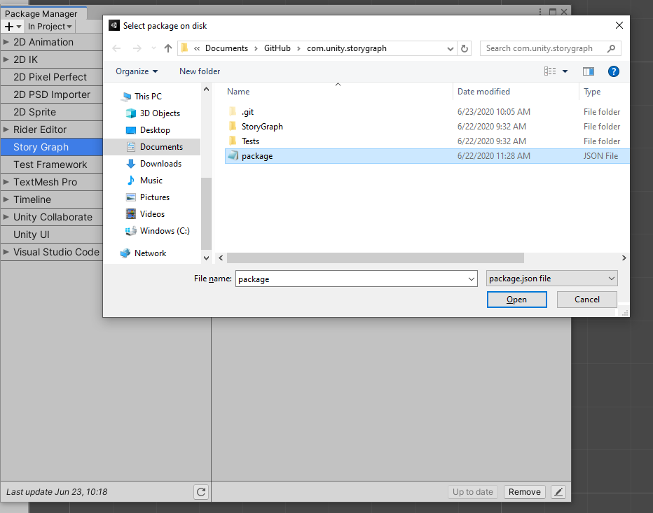

# Using StoryBuilder

To install the StoryBuilder package, make a clone of the git package's [Git repository](https://github.cds.internal.unity3d.com/unity/com.unity.StoryBuilder) on your local machine. Then, in the Unity Editor, select **Window > Package Manager**. Click on the plus icon and from the sub-menu, select **Add package from disk...**.

  
*The Package Manager window showing the Add Package From Disk option*

This brings up a file browser. Navigate to the folder where you cloned the StoryBuilder repository. Inside the project, select the package.json file and click on the **Open** button, or double click on the package.json file. The package.json file is located in the root folder.

  
*The package.json file inside the StoryBuilder package's root folder*

The package is now installed and two new menu items should appear in the Unity Editor, called **StoryBuilder** and **Bare GraphView**. 